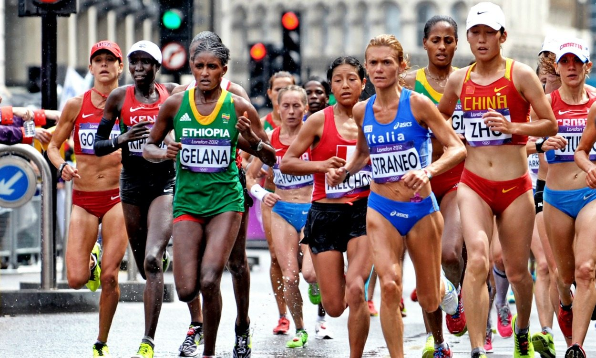
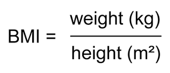

<html>

</html>
<br/>
<p align="center">
<font size="20" color="White" face="Trebuchet MS" style="border:2px solid DeepSkyBlue">120 Years of Olympic History</font>
</p>
<br/>
## This is a historical dataset on the modern Olympic Games, including all the Games from Athens 1896 to Rio 2016.
### The file contains 271,116 rows and 15 columns. Each row corresponds to an individual athlete competing in an individual Olympic event.
<p align="left">
<font size="4">The dataset included:</font> 
</p>
```markdown
- ID: Unique number for each athlete
- Name: Athlete's name
- Sex: M or F
- Age: Integer
- Height: In centimeters
- Weight: In kilograms
- Team: Team name
- NOC: National Olympic Committee 3-letter code
- Games: Year and season
- Year: Integer
- Season: Summer or Winter
- City: Host city
- Sport
- Event
- Medal: Gold, Silver, Bronze, or NA
```
_Note that the Winter and Summer Games were held in the same year up until 1992. After that, they staggered them such that Winter Games occur on a four year cycle starting with 1994, then Summer in 1996, then Winter in 1998, and so on._
<br/>
<br/>
## We also pulled data from a Wikipedia page detailing the [2016 Summer Olympics Women's Marathon results.](https://en.wikipedia.org/wiki/Athletics_at_the_2016_Summer_Olympics_–_Women%27s_marathon)
### Time was the information that this dataset provided that was not included in the original dataset.
<p align="left">
<font size="4">The dataset included:</font> 
</p>
```markdown
- Rank
- Athlete's Name
- Nationality
- Time
```

<br/><br/>
<p style="border:2px solid Gold">
<font align="center" size="6" color="White">Questions</font><br/>
<font align="left" size="5">1. What factors contribute to the performance of an athlete?</font><br/>
<font align="left" size="5">2. How are athletes changing, per sport, over time?</font><br/>
</p>
### As a result of the size of our dataset we aimed to narrow our scope by focusing on the marathon specifically. This was the sport in which we analyzed the most extensively. Specifically, we make many comparisons between male and female athletes who competed in the marathon event.
<br/><br/>
<p align="center">
<font size="7" style="border:2px solid Tomato">Context Information</font>
</p>
<p align="center">
<br/>
<br/>
<font size="5">The men's marathon has been present on the Olympic athletics program since 1896, but the women's event wasn't added until ninety years later in 1984.</font>
</p>
<br/>
<p align="center">
<br/>
<font size="3">Joan Benoit of the U.S. breaks away from the pack on her way to winning the first Olympic women's marathon during the 1984 Summer Olympic Games in Los Angeles.</font>
</p>
<br/>
<p align="center">
  <font size="5">Medal Counts by Country for Men and Women's Marathon</font><br/>
  <br/>
  
</p>
_The Unified Team was the name used for the sports team of the former Soviet Union at the 1992 Winter Olympics in Albertville and the 1992 Summer Olympics in Barcelona._
### These graphs show us the countries that are most represented in our future graphs that are broken down by medal type.
<br/><br/>
<p align="center">
<font size="7" style="border:2px solid Tomato">Answering our Questions</font>
</p>
<p align="center">
  <font size="5">Change in Average BMI Over Time for Men and Women's Marathon</font><br/>
  <br/><br/>
  <font size="4">We reached our conclusions using the following calculation.</font><br/>
   
  
</p>
### Analysis 
<br/>
<p align="center">
  <font size="5">Height Distributions of Men and Women's Marathon Non-Medalists vs. Medalists (in centimeters)</font><br/>
   
  
</p>
### Analysis 
<br/>
<p align="center">
  <font size="5">Weight Distributions of Men and Women's Marathon Non-Medalists vs. Medalists (in kilograms)</font><br/>
   
  
</p>
### Analysis 
<br/>
<p align="center">
  <font size="5">Age Distributions of Men and Women's Marathon Non-Medalists vs. Medalists</font><br/>
   
  
</p>
### Analysis 
<br/>
<p align="center">
  <font size="5">BMI Distributions of Men and Women's Marathon Non-Medalists vs. Medalists</font><br/>
   
  
</p>
### Analysis 
<br/><br/>
<p align="center">
<font size="7" style="border:2px solid Tomato">Summary</font><br/>
</p>
### Analysis
