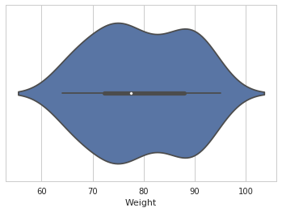
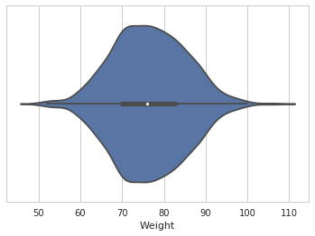
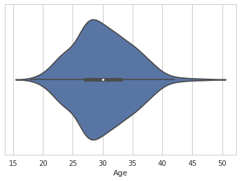
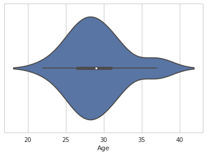
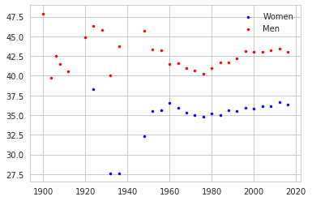
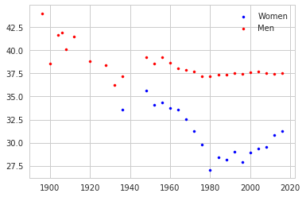

<html>
  
</html>

# 120 Years of Olympic History 
<br/>
## This is a historical dataset on the modern Olympic Games, including all the Games from Athens 1896 to Rio 2016. 
### The file contains 271,116 rows and 15 columns. Each row corresponds to an individual athlete competing in an individual Olympic event. 
<br/>
**The dataset included:**
```markdown
- ID: Unique number for each athlete
- Name: Athlete's name
- Sex: M or F
- Age: Integer
- Height: In centimeters
- Weight: In kilograms
- Team: Team name
- NOC: National Olympic Committee 3-letter code
- Games: Year and season
- Year: Integer
- Season: Summer or Winter
- City: Host city
- Sport
- Event
- Medal: Gold, Silver, Bronze, or NA
```
_Note that the Winter and Summer Games were held in the same year up until 1992. After that, they staggered them such that Winter Games occur on a four year cycle starting with 1994, then Summer in 1996, then Winter in 1998, and so on._
<br/>
<br/>
## We also pulled data from a Wikipedia page detailing the [2016 Summer Olympics Women's Marathon results.](https://en.wikipedia.org/wiki/Athletics_at_the_2016_Summer_Olympics_–_Women%27s_marathon) 
<br/>
**The dataset included:**
```markdown
- Rank
- Athlete's Name
- Nationality
- Time
```
_Time was the information that this dataset provided that was not included in the original dataset._
<br/>
<br/>
## The questions we tried to answer were as follows:
```markdown
1. What factors contribute to the performance of an athlete?
2. How are athletes changing, per sport, over time?
```
<br/>
## These visualizations examine the different weight distributions between medalists and non-medalists in the men's slalom alpine skiing event. 
### Medaled 

### Did Not Medal 


<br/>
## These visualizations examine the age distributions between women marathoners and medalists in the women's marathon.
### Women's Marathoner Ages

### Women's Marathon Medalist's Ages


<br/>
## These visualizations examine the change in average BMI over time between men and women in two different sports. 
### Swim BMI

### Gymnastics BMI



<p float="center">
  
   
</p>


Your Pages site will use the layout and styles from the Jekyll theme you have selected in your [repository settings](https://github.com/goulce01/DataVisualizationProject/settings). The name of this theme is saved in the Jekyll `_config.yml` configuration file.

### Support or Contact

Having trouble with Pages? Check out our [documentation](https://help.github.com/categories/github-pages-basics/) or [contact support](https://github.com/contact) and we’ll help you sort it out.
